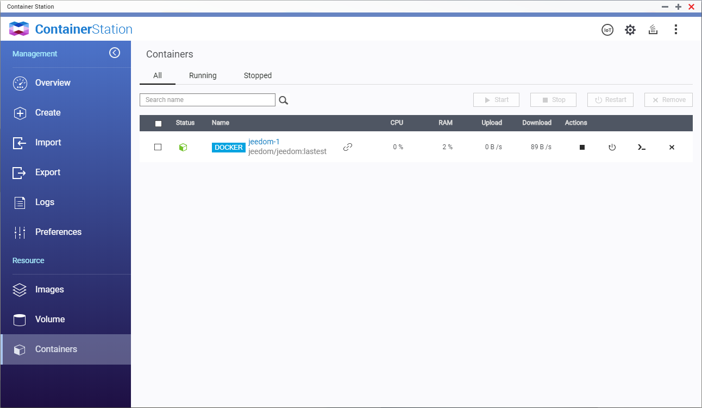

# Installation de Jeedom sur un QNAP

Pour installer Jeedom nous allons passer par Docker. Sur QNAP c'est Container Station.

## Installation du Docker Jeedom

- Ouvrez `Container Station`
- Dans le champ de recherche tapez "jeedom"
    - Vous devriez trouver dans Docker Hub "jeedom/jeedom", cliquez sur `install`
    
- Selectionnez la version `latest`
- Une page va s'ouvrir "Create Container"
    - Donner un nom à votre Container
    - Fixer le `CPU Limit` et le `Memory Limit`
    
    - Cliquer sur `Advanced Settings`
    - Dans l'onglet `Network`
        - Ajouter 2 port NAT, pour le WEB et pour le SSH
        
    - Dans l'onglet `Device`
        - Cochez `Run containers in privileged mode`
        
    - Cliquer sur `Create`

- Le container va ce telecharger et s'installer (~1.4Go)

## Installation de mysql

- Dans l'onglet `Containers` cliquer sur `jeedom-1` (le nom de votre docker)

- Cliquer sur `Terminal` et entrer la commande suivante :
```
/bin/bash
```

- Une nouvelle fenettre va s'ouvrir (le terminal de votre Docker), entrer les commandes suivantes :
```
sudo apt update
sudo apt -y dist-upgrade
sudo apt install -y default-mysql-server nano
```
Une fois mysql installer nous allons le parametrer
```
/etc/init.d/mysql start
mysql_secure_installation
```
- Taper `enter` pour le mot de passe courant
- pour "set root password?" taper `Y`
- Entrer un nouveau mot de passe
- Confirmer le
- pour "Remove anonymous users?" taper `Y`
- pour "Disallow root login remotely?" taper `N`
- pour "Remove test database and access to it?" taper `N`
- pour "Reload privilege tables now?" taper `Y`

Votre mysql est configurer, il faut maintenant le lancer automatiquement lorsque votre Docker ce lance, pour cela nous allons éditer le fichier `/root/init.sh`

```
nano /root/init.sh
```
A la fin du fichier ajouter ces lignes devant "/usr/bin/supervisord"
```
echo 'Start MySQL'
sudo /etc/init.d/mysql restart
```
faite `ctrl+x`, `y`, `enter` pour sauvegarder et quitter

Redemarrer votre Docker

## Probleme liée à notre installation

Me concernant j'ai 2 problèmes lors du lancement de Jeedom


### Correction du premier probleme (tache cron)

Lancer un terminal (comme precedement) et taper ceci :
```
echo "* * * * * www-data /usr/bin/php /var/www/html/core/php/jeeCron.php >> /dev/null" > /etc/cron.d/jeedom
```

### Correction du second probleme

Toujours dans le terminal :
```
sed -i 's/max_execution_time.*/max_execution_time = 600/g' /etc/php/7.3/apache2/php.ini
sed -i 's/upload_max_filesize.*/upload_max_filesize = 1G/g' /etc/php/7.3/apache2/php.ini
sed -i 's/post_max_size.*/post_max_size = 1G/g' /etc/php/7.3/apache2/php.ini
```

Redemarrer votre Docker

## Finalisation de l'installation de Jeedom

Il faut maintenant configurer mysql pour Jeedom. Pour cela entrer le mot de passe (precedement configurer) de votre mysql


Cliquer sur `Proceed` et attendez la fin de la configuration (~30s)

Cliquer sur `Click here` pour vous loger sur Jeedom.


- Nom d'utilisateur par defaut : `admin`
- Mot de passe par defaut : `admin`

Il vous demandera de modifier le mot de passe par defaut et de vous connecter au market.

Félicitation votre Jeedom est prêt !